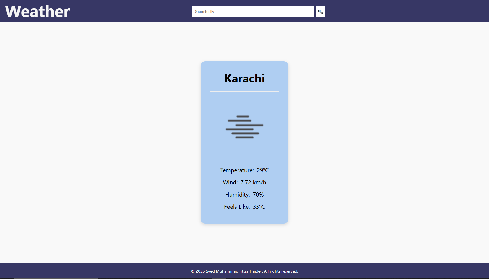

# 🌤️ Weather App

A simple weather app built with HTML, CSS, and JavaScript. It lets users search for any city and displays real-time weather data using the [OpenWeatherMap API](https://openweathermap.org/api).

---

## 🔍 Features

- Live weather updates for any city
- Displays:
  - Temperature (°C)
  - Wind speed (km/h)
  - Humidity (%)
  - Feels like temperature
  - Weather icon
- Error handling for invalid city names
- Responsive design for mobile & desktop

---

## 📸 Preview



---

## 🚀 How to Use

1. Clone this repo:
   ```bash
   git clone https://github.com/your-username/weather-app.git
   ```
2. Open index.html in your browser.
3. Enter the city name and click the search button or press Enter.

## 🔧 Built with

- HTML
- CSS
- JavaScript
- [Open Weather Map API](https://openweathermap.org/api).

## 📁 Folder Structure

```
WEATHER APP/
│
├── html/
│ └── index.html
│
├── css/
│ └── style.css
│
├── js/
│ └── script.js
│
├── README.md
```

## 📜 License

This project is licensed under the [MIT License](https://opensource.org/license/MIT)

## ✍️ Author

Syed Muhammad Irtiza Haider

Front-end Developer

Email: developerirtiza@gmail.com

© 2025 All rights reserved
